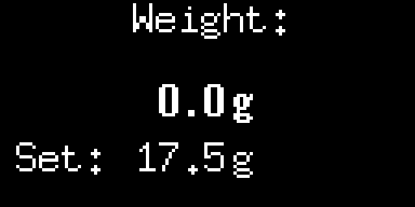
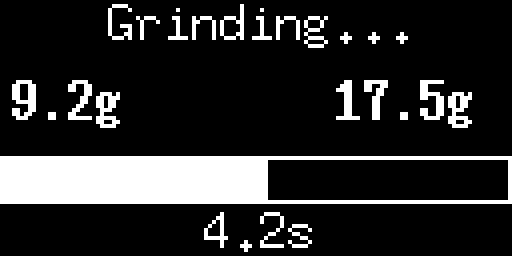
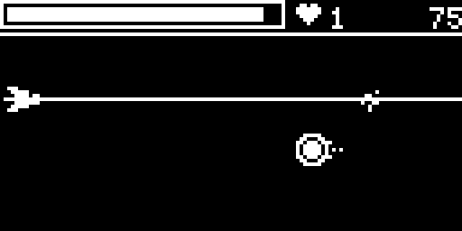
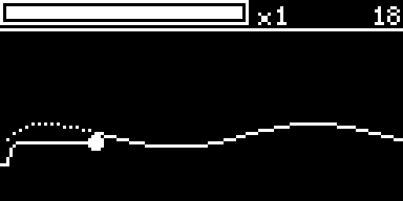
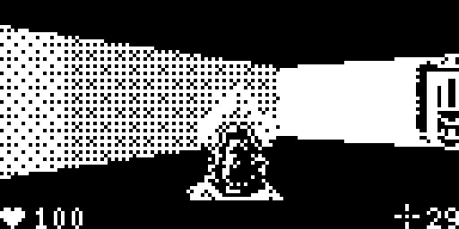

# OpenGBW for the Eureka Mignon MCI with games

A grind by weight scale for the Eureka Mignon MCI with a 1kg load cell, support for a second dosing cup or portafilter and three games played with the knob and the scale. It works without a relay and should also work with other Mignon grinders.

-----------

### Differences

Changes on top of the version this is based on (see [Origin](#origin)):

- **Games:** Comet Blaster, Curve Tracer and Doom, controlled with the knob and the pressure on the scale
- **3D models:** for the Mignon MCI (see [Hardware](#hardware-on-the-mignon-mci))
- **Grinding:** two dosing cups; the grinder is stopped on the mass flow rather than on a fixed offset in grams, the dead time it keeps delivering afterwards is calibrated after every grind; aborts on timeout (60 seconds), missing progress, a removed cup or a scale error, with the reason shown on the display; no early stop caused by vibration spikes and no interruption by the display timer
- **Calibration:** "Scale Factor" menu to calibrate while watching the live weight (replaces the calibration with a 100g weight), scale factor shown in the Info Menu
- **Operation:** weights aligned on the decimal point, reworked menu (Exit first, cup weight menus can be left by turning), reversed encoder direction, continuous as default grinding mode, fixed sleep timer that is kept after a restart and wakes the display when the scale is tapped
- **Debug Menu:** Weight Data of the last 100 readings, Weight History of the last 10 grinds
- **Filters and logging:** the weight is filtered better and the scale can send every single reading of the load cell over USB, which is what the filters were built on - see [docs/README_LOGGING.md](docs/README_LOGGING.md)
- **Defaults for my setup:** cup weights 396.1g and 76.3g, scale factor 1760 (1kg load cell), dose 17.5g, dead time 0.30s, grinder on GPIO 25

-----------

### Hardware on the Mignon MCI

#### Bill of materials

- ESP32 development board
- OLED display 128x64 (SSD1306, I2C)
- 1kg load cell with HX711 amplifier
- Rotary encoder with push button
- NPN transistor
- Small resistor (e.g. 1 kOhm)
- Wires
- 3D printed parts from [3D/Mignon MCI](3D/Mignon%20MCI)

#### Wiring

**Power supply:** my version of the MCI has 3.0V output pins on the mainboard, which I use to power the ESP32. It works, even though the ESP32 actually needs 3.3V. WiFi does not work at this voltage, though, which is why this version is not based on SyButter's latest state with WiFi and web server (see [Origin](#origin)).

**Starting the grinder:** the grinder is started by the switch at the top, below the coffee outlet, which carries a 12V signal. The ESP32 is wired in parallel to this switch: it drives a transistor from GPIO 25 through a small resistor, and the transistor switches the 12V signal just like the switch does. No relay is needed.

**Connection to base:** all electronics sit in the 3D printed base. For the three wires to the MCI (power, ground and signal) I drilled a small hole in the bottom of the MCI.

*Opening the grinder and working on its electronics is at your own risk.*

-----------

### Origin

This project has been passed on through several forks:

1. **Guillaume Besson ([geekuillaume](https://github.com/geekuillaume/coffee-grinder-smart-scale))** built the original coffee grinder smart scale. More info: https://besson.co/projects/coffee-grinder-smart-scale
2. **[jb-xyz/openGBW](https://github.com/jb-xyz/openGBW)** adapted it as openGBW: rotary encoder to select the weight and navigate menus, all settings configurable without compiling your own firmware, dynamic adjustment of the offset after each grind, relay support, different ways to activate the grinder, scale only mode and 3D models for the Eureka Mignon XL.
3. **[SyButter/openGBW](https://github.com/SyButter/openGBW)** commented and restructured the code and added a confirmation screen and escape for the cup weight, the Info Menu, wake on rotary turn, the sleep timer in the menu, the shot counter and the Debug Menu.
4. **This version** is based on SyButter's state of December 26, 2024 (commit `becc51d`), not on his latest state. His later changes (WiFi and web server, Seeed Studio XIAO ESP32-C3, PCB, switch start) are not included, mainly because WiFi does not work with the 3.0V supply of the MCI (see [Hardware](#hardware-on-the-mignon-mci)). On top of that come the [Differences](#differences) listed above.

The game **Doom** is based on [daveruiz/doom-nano](https://github.com/daveruiz/doom-nano) (raycaster, enemies, sprites, font and level) and the doors of [ZelTroN-2k3/Doom-Nano-ESP32](https://github.com/ZelTroN-2k3/Doom-Nano-ESP32), reworked for the knob and the scale.

-----------

### Getting started

1) 3D print the included models for a Eureka Mignon MCI or Mignon XL or design your own
2) flash the firmware onto an ESP32
3) connect the display, load cell and rotary encoder to the ESP32 and connect the grinder (on the Mignon MCI see [Hardware](#hardware-on-the-mignon-mci), other grinders may need a relay). The pins are defined in `include/config.hpp`
4) go into the menu by pressing the button of the rotary encoder and look at "Dead Time", the time your grinder keeps delivering after it is switched off. 0.30s is a good enough starting value, the scale calibrates it from there
5) set the grinding mode: on the Mignon MCI use continuous (the default) and set the grinder to manual mode (see [Hardware](#hardware-on-the-mignon-mci)). Use impulse if your grinder needs a short pulse to start and another one to stop.
6) calibrate your load cell: open "Scale Factor", place a known weight on the scale and turn the knob until the live weight matches, then press to save
7) set your dosing cup weights: open "Cup Weight 1", place the empty cup on the scale and press. Repeat with "Cup Weight 2" if you use a second cup or portafilter.
8) set your desired weight and place one of your empty dosing cups on the scale. The grinding will start and stop automatically. The first grind might be off by a bit. The accuracy will increase with each grind as the scale calibrates the dead time of the grinder

-----------

### Usage

#### Main screen

Turn the knob to set the target weight. Place an empty dosing cup on the scale: as soon as it has rested on the scale for one second within 10g of one of the two saved cup weights, the grinder starts. The grinder stops as soon as the target weight is reached, the display then shows "Verifying" until the reading has settled and only afterwards the final weight and the grinding time. Remove the cup to get back to the main screen.

 

#### Menu

Press the knob on the main screen to open the menu, turn to select and press to open an item.

| Item | Function |
|---|---|
| Exit | back to the main screen |
| Cup Weight 1 / Cup Weight 2 | place the empty cup and press to save its weight, turn to leave without saving |
| Scale Factor | turn to change the calibration factor while watching the live weight, press to save |
| Dead Time | how long the grinder keeps delivering after it was switched off, between 0 and 2s. The grinder stops as soon as the weight still to come carries the dose over the target, so this is what decides the dose. After every grind 40% of the deviation is corrected automatically, so it settles on the right value within a few grinds |
| Scale Mode | GBW (default) or scale only (no grinder control, timer starts when the weight increases) |
| Grinding Mode | continuous (relay stays closed while grinding) or impulse (short pulse to start and stop) |
| Info Menu | cup weights, dead time, scale factor and shot count |
| Sleep Timer | time without activity until the display turns off (default 60 seconds). Tapping the scale, turning or pressing the knob wakes it without changing anything |
| Reset | restore all settings to their defaults |
| Games | see below |
| Debug Menu | only visible in debug mode, toggled by pressing the knob four times quickly |

#### Debug Menu

| Item | Function |
|---|---|
| Sim Grind | simulates a grind without the grinder |
| Weight Data | graph of the last 100 scale readings |
| Weight History | the last 10 grinds (kept after power off), turn to scroll: shot number, grinding time, the dead time the grinder was stopped with and the mass flow at that moment in g/s, press the scale for target weight, actual weight and their difference, pull it up to go back |
| Zero Shot Count | resets the shot counter to 0 |

#### Games

All games use the scale as a pressure sensor: remove the cup and press on the scale with your finger. Press the knob during a game to pause or exit (hold it in Doom). The best score of each game is saved.

- **Comet Blaster**: comets fly in from the right. Turn the knob to move your ship and press the scale to fire the laser: the harder you press, the wider and stronger the beam, but the more energy it uses. Comets have to be hit near their center and give points and energy, bigger comets give more. A collision costs a life; hearts flying by give extra lives, but only if you fly into them - the laser destroys them.

  

- **Curve Tracer**: a line scrolls in from the right. The pen follows the pressure on the scale - the more you press, the higher it goes. Stay on the line to score points and build up a multiplier, leaving it drains the grip bar. The line gets faster and the curves get steeper over time.

  

- **Doom**: a small first person shooter in the style of Wolfenstein 3D with sprites from Doom. Press the scale to walk forward and pull it up gently to walk backward (the harder, the faster), turn the knob to look around and click to fire. Dead enemies drop ammo. Doors open when you walk into them, locked doors need a key. The pause menu has a map of the explored level. Find the exit, the fastest time is saved.

  

------------
### To-Do

- Game: Snake https://github.com/Stiju/arduino_snake 
- Better Loading Screen
- Game: Flappy Bird
- Debug-Option: Disable Grinding (Show Dot or something instead)
- Game: Death Star: https://drive.google.com/drive/folders/19_JMvg4HcsPCw0QcT5VSEuF0uNpCn1_V
- Game: Pong
- Game: Tiny Wings
- nach grind finished noch durch drehen mehr kaffee nachmahlen?
- Statistiken nach malvorgang einblendbar machen
- Readme für tools und filter
